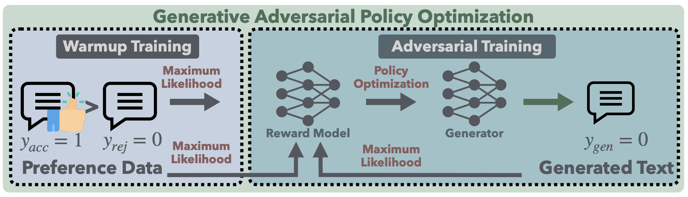

# GAPO: Learning Preferential Prompt through Generative Adversarial Policy Optimization
[](LICENSE)  [](https://arxiv.org/abs/2503.20194)

Official implementation of the paper *"GAPO: Learning Preferential Prompt through Generative Adversarial Policy Optimization"*. This repository is built upon the [OpenRLHF](https://github.com/OpenRLHF/OpenRLHF) framework with modifications for GAPO implementation.



## Overview
GAPO introduces a novel framework combining GAN-based training dynamics with encoder-only reward models for constrained text generation. Key features:
- 🛠️ **Adversarial Training**: Automatically generates training samples with progressive difficulty
- 🔍 **Encoder-only Reward Model**: Better captures prompt-response relationships
- 🚀 **Performance Advantages**: Outperforms PPO/DPO/KTO in fine-grained constraint handling
- ⚙️ **Optimized Stability**: Iterative automated training of generator and reward model

## Quick Start
### Installation
```bash
# Install dependencies
pip install -r requirements.txt

# (Optional) Install with vLLM support
pip install openrlhf[vllm]
```

### Training
```bash
# Launch GAPO training for Qwen-7B with Longformer reward model
bash train_gapo_qwen_longformer.sh
```

## Citation
```bibtex
@article{gu2025gapo,
  title={GAPO: Learning Preferential Prompt through Generative Adversarial Policy Optimization},
  author={Gu, Zhouhong and Chen, Xingzhou and Shi, Xiaoran and Wang, Tao and Zheng, Suhang and Li, Tianyu and Feng, Hongwei and Xiao, Yanghua},
  journal={arXiv preprint arXiv:2503.20194},
  year={2025}
}
```

## Acknowledgements
This implementation is based on the [OpenRLHF](https://github.com/OpenRLHF/OpenRLHF) framework. We sincerely thank the OpenRLHF team for their excellent work in creating a high-performance RLHF infrastructure.

## License
This project is released under the Apache License 2.0. See [LICENSE](LICENSE) for details.
